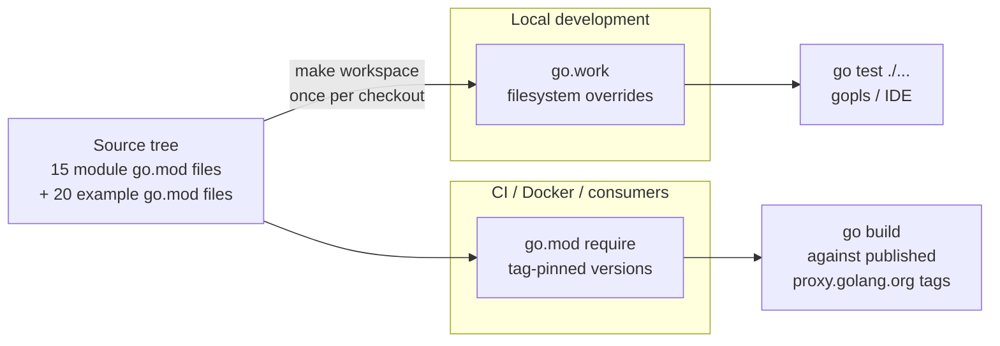

[&larr; Back to README](../README.md)

# Multi-Module Development Workflow

> Workflow mechanics for contributors to the audit monorepo —
> what `make workspace` does, why every sub-module has its own
> `go.mod`, and how releases / Docker / consumers all see different
> things than your local checkout. Coding standards and the
> contribution-process rules are in
> [CONTRIBUTING.md](../CONTRIBUTING.md); this doc is the workflow
> half.

## Contents

- [TL;DR (Quick start)](#tldr-quick-start)
- [Day-to-day development](#day-to-day-development)
- [The workspace explained](#the-workspace-explained)
- [Why multi-module](#why-multi-module)
- [The release cycle](#the-release-cycle)
- [Docker and external consumers](#docker-and-external-consumers)
- [Troubleshooting](#troubleshooting)
- [Where to look next](#where-to-look-next)

## TL;DR (Quick start)

Four commands turn a fresh clone into a working dev environment
that matches CI:

```bash
git clone https://github.com/axonops/audit.git
cd audit
make install-tools
make workspace
make check
```

What each does:

| Command            | What it does                                            | Time |
|--------------------|---------------------------------------------------------|------|
| `make install-tools` | Installs `golangci-lint`, `goimports`, `govulncheck`, `goreleaser` (pinned versions) under `$(go env GOPATH)/bin`. Idempotent. | ~30 s first run |
| `make workspace`   | Generates `go.work` at the repo root. The file is git-ignored. Tells the Go toolchain "use the local filesystem for every sibling module instead of the published tag pinned in `go.mod`." | <1 s |
| `make check`       | Full local quality gate — formatting, vet, lint, unit tests under `-race`, security scan, module hygiene. Matches CI. | ~3–6 min |

After `make workspace` runs you'll see a new `go.work` at the
repo root (gitignored). Its content is just a list of modules the
workspace covers:

```
go 1.26.3

use (
    .
    file
    iouring
    syslog
    webhook
    loki
    outputconfig
    outputs
    cmd/audit-gen
    cmd/audit-validate
    secrets
    secrets/env
    secrets/file
    secrets/openbao
    secrets/vault
    examples/01-basic
    examples/02-code-generation
    examples/03-file-output
    examples/17-testing
    examples/04-formatters
    examples/15-middleware
    examples/06-syslog-output
    examples/07-webhook-output
    examples/09-multi-output
    examples/10-event-routing
    examples/11-sensitivity-labels
    examples/12-hmac-integrity
    examples/05-standard-fields
    examples/08-loki-output
    examples/13-tls-policy
    examples/14-buffering
    examples/20-capstone
    examples/16-health-endpoint
    examples/18-migration
    examples/19-prometheus-reference
)
```

> The exact module count is whatever `make print-publish-modules`
> plus the count of `examples/*/go.mod` returns at HEAD. The list
> above is illustrative — the file is regenerated by `make
> workspace` from the Makefile's `WORKSPACE_MODULES` variable.

### Prerequisites

- **Go toolchain.** The module files declare `go 1.26.3`. Any Go
  toolchain that supports `GOTOOLCHAIN` auto-download (Go 1.21 or
  newer) will fetch 1.26.3 automatically unless `GOTOOLCHAIN=local`
  is set in your environment. If you need a deterministic local
  toolchain, install go1.26.3 explicitly:
  `go install golang.org/dl/go1.26.3@latest && go1.26.3 download`.
- **GNU `make`** on PATH. Windows: use WSL or install
  `make` via Chocolatey/Scoop.
- **`$(go env GOPATH)/bin` on `PATH`** if you want to invoke
  tools directly (e.g. `golangci-lint run`). The Makefile uses
  absolute paths so `make check` works regardless.
- **Docker** is only required for BDD / integration suites
  (`make test-bdd`, `make test-integration`). `make check` runs
  without Docker.
- **Git line endings on Windows**: set `core.autocrlf=false` or
  `core.autocrlf=input` to avoid CRLF in committed source.

## Day-to-day development

Once the workspace exists, the inner loop is plain Go:

```bash
# Edit code in any module — core, sub-modules, or examples.
$EDITOR webhook/webhook.go
$EDITOR examples/07-webhook-output/main.go

# Fast inner-loop checks (no full lint, no security scan).
# Run this on every save / before every commit:
make check-static     # ~10-30 s — fmt, vet, tidy, license headers, etc. (slower on cold cache after a pull)

# Full local quality gate (matches CI; slower):
make check            # ~3–6 min — fmt + vet + lint + tests + security

# Run tests for just the module you're editing:
make test-core        # core package (.)
make test-file        # file sub-module
make test-syslog      # syslog sub-module
make test-webhook     # webhook sub-module
make test-loki        # loki sub-module
make test-outputconfig
make test-secrets
make test-secrets-vault
make test-audit-gen
make test-audit-validate

# Format + auto-fix imports before commit (matches `make fmt-check`):
make fmt

# Run BDD scenarios (requires Docker for some shards):
make test-bdd               # all shards
make test-bdd-webhook       # webhook shard only
make test-bdd-loki          # loki shard only
make test-bdd-core          # core feature files
```

**You can edit any module — including examples and `cmd/`
binaries — without changing your `cd`.** Tests resolve cross-
module imports through the workspace, so a change in
`webhook/webhook.go` is immediately visible to a test in
`examples/07-webhook-output/`.

**Don't add `replace` directives** in any committed `go.mod`.
`go.work` is the supported mechanism for local cross-module
development; `replace` is rejected by `make check-replace`
(which runs in `make check-static`) and would also fail the
release flow. If a `replace` seems necessary, the workspace
setup is broken — try
`rm go.work go.work.sum && make workspace`. The one narrow
exception — a temporary `replace` for cross-module Docker
debugging — is documented in
[Docker and external consumers](#docker-and-external-consumers)
and must NEVER be committed.

**Don't run `make workspace` inside Docker builds or on CI
runners.** Those build contexts intentionally resolve every
import through `proxy.golang.org` using the tag pinned in
`go.mod` — exactly the way external consumers see the library.
The workspace is a developer-machine-only convenience.

### IDE setup

Open the **repository root** in your IDE (not a sub-module
directory). `gopls` picks up `go.work` from the root and
resolves cross-module references correctly.

- **VS Code**: install the official Go extension; reload when
  prompted after `make workspace`.
- **GoLand**: enable "Go Modules" support; if cross-module
  jumps stop working after a branch switch, run
  `File → Invalidate Caches`.
- **Other IDEs / `gopls`-based tooling**: workspace mode is
  Go-toolchain-native, so anything that speaks `gopls` should
  work. File a contributor issue if your IDE behaves
  surprisingly with the workspace.

## The workspace explained

`go.work` is the Go toolchain's mechanism for working on
multiple modules at once. When a workspace file is present at
the repo root, `go build` / `go test` / `gopls` /
`golangci-lint` all see the local filesystem versions of every
module in the workspace — even if the `require` directives in
`go.mod` pin different versions.

That dual-resolution path is the key concept:



**Local dev: workspace wins.** When you run `go test` from the
repo root, the toolchain sees `go.work`, walks the `use ( ... )`
list, and resolves every import like `github.com/axonops/audit/file`
to the local `file/` directory rather than the version your
`go.mod` requires. Your unreleased changes in `audit/file`
immediately affect anything that imports it.

**CI / Docker / consumers: `go.mod` wins.** Outside the
workspace, Go resolves imports through the module proxy
(`proxy.golang.org`) using the exact versions named in
`go.mod`'s `require` block. CI does not run `make workspace`;
Docker can't (the build context only sees `COPY`'d files);
consumers don't have your repo at all.

The version pins in your `go.mod` files look "stale" during
development — they reference the last release, not your
current branch's source. That's correct. Releases (see
[The release cycle](#the-release-cycle)) rewrite them; day-to-day
development ignores them via the workspace.

### Why `go.work` is gitignored

The workspace is per-developer convenience. Committing it would:

- Force every contributor onto the same module subset (some
  contributors might want to exclude examples for a faster
  inner loop).
- Break CI, which runs against published tags exactly the way
  consumers do.
- Conflict on every branch switch when the `WORKSPACE_MODULES`
  list changes.

The `Makefile`'s `workspace:` target regenerates the file in
under a second, so a fresh checkout is cheap.

## Why multi-module

The repo has one core module (`github.com/axonops/audit`) plus
14 sub-modules and 20 example modules — each with its own
`go.mod`. Three reasons:

**1. Independent publishability.** A bug fix in
`audit/loki` can ship as `audit/loki v0.5.2` without re-tagging
core `audit`. Consumers who only use `audit/file` don't pull
the fix's transitive churn.

**2. Trust and dependency isolation.** Each sub-module declares
its own transitive deps. `audit/secrets/vault` depends on
`hashicorp/vault/api`; a consumer who only uses
`audit/secrets/env` doesn't pull that. Same for
`audit/iouring`, `audit/loki`, etc.

**3. Versioning alignment with surface area.** Output modules
(file, syslog, webhook, loki) evolve at different rates from
the core auditor. Decoupling versions lets each surface
mature on its own schedule.

The trade-off is the development complexity this doc exists
to manage — cross-module changes need the workspace to compile;
release coordination needs the unified-tag flow in
[releasing.md](releasing.md).

## The release cycle

Full release flow is in [docs/releasing.md](releasing.md) —
that's the maintainer-facing source of truth. Contributors
don't cut releases, but four things about the release flow
affect day-to-day work:

**1. `go.mod` versions change automatically.** The release
workflow runs `scripts/release/update-deps.sh`, which rewrites
every `go.mod` to pin inter-module deps at the new tag (e.g.
all `audit/*` modules pin `audit v0.1.14`). Don't be surprised
when a `release/v0.1.14` branch shows go.mod files that look
different from main — that's the script doing its job. The
update is reverted into the new state on `main` after the
release PR auto-merges.

**2. `SKIP_TIDY_CHECK` invariant on `release/*` branches.**
The release PR pins go.mod files to a tag that doesn't yet
exist on origin (`tag-all` runs AFTER the PR merges). `go mod
tidy` would fail to resolve, so CI sets `SKIP_TIDY_CHECK=1` on
branches matching `release/*`. See
[releasing.md → Unified single-tag release flow](releasing.md#unified-single-tag-release-flow)
for the full invariant. Contributors don't need to think about
this unless they're editing `update-deps.sh` itself.

**3. Tag protection.** Every published module's `v*` tag
pattern is protected — only the `axonops-audit-release-bot`
App can create them. `git push origin v0.1.99` from a
contributor account is rejected by GitHub.

**4. `make api-check`.** Pre-release the workflow runs
`gorelease` against every published module to catch breaking
API changes. If your PR breaks the public surface of, say,
`audit/file`, `make api-check` will flag it locally too. Run
it before opening a PR that touches an exported symbol.

## Docker and external consumers

**Docker builds can't use the workspace.** A `Dockerfile`'s
build context contains only what `COPY` brings in, and even
then `go build` inside the container doesn't see a `go.work`
unless it's also copied — which it shouldn't be, because that
would let the Docker image bake in unreleased local changes.

Concrete examples in the repo:

- **`examples/20-capstone/Dockerfile`** copies its own
  `go.mod` / `go.sum` and runs `go build` against
  proxy.golang.org versions. The local workspace is invisible
  to the build.
- **`cmd/audit-gen`** ships an OCI image via the unified
  release flow (#610). The image's `audit-gen` binary is
  built by GoReleaser against the just-tagged release version,
  not against any developer's workspace.

If you edit a sub-module and want to test the change inside
the capstone container, you have three options, ordered by
realism:

1. **Bump the local module's go.mod and rebuild the image.**
   Edit `examples/20-capstone/go.mod` to add
   `replace github.com/axonops/audit => ../../`. **This is the
   one exception to the [no-`replace` rule](#day-to-day-development)
   — acceptable for local debugging only.** Stash or revert the
   edit before any `git commit`; `make check-replace` will fail
   CI on a committed `replace` directive.
2. **Cut a pre-release tag and let CI build the image.** For
   changes that need real Docker testing across multiple
   machines. See [docs/releasing.md](releasing.md) for the
   pre-release tag flow — note that pre-release tags still
   require maintainer involvement (tag protection applies).
3. **Run the example directly (no container).** The capstone
   `main.go` can run from the workspace, so cross-module
   debugging usually doesn't need Docker.

**External consumers see the same world Docker does.** Their
`go get github.com/axonops/audit/file@latest` returns the
proxy's view (the latest tag), not your workspace. The
library's public-API guarantees apply to that surface — not
your unreleased changes.

## Troubleshooting

### `go: cannot find module providing package github.com/axonops/audit/...`

**Cause:** `make workspace` hasn't been run after a fresh
checkout, OR `go.work` was deleted by a stale `make clean`.

**Fix:**

```bash
make workspace
```

### `go.mod file indicates go 1.x but the current version is 1.26`

**Cause:** Your local Go toolchain is older than `go 1.26.3`.

**Fix:** Either upgrade Go (`go install golang.org/dl/go1.26.3@latest && go1.26.3 download`) or rely on the `GOTOOLCHAIN` auto-download. If you have `GOTOOLCHAIN=local` set in your env, unset it.

### `make test` fails with `unknown revision <version>` on a sub-module path

**Cause:** Workspace is broken or `GOWORK=off` is in your env.

**Fix:**

```bash
echo "$GOWORK"           # if non-empty, unset it
unset GOWORK
rm go.work go.work.sum
make workspace
```

### `Docker build fails: package github.com/axonops/audit not found`

**Cause:** The `Dockerfile`'s `COPY` didn't bring in the
sub-module the build needs, OR you're relying on the workspace
inside Docker (which can't work — see
[Docker and external consumers](#docker-and-external-consumers)).

**Fix:** Check the `Dockerfile`'s `COPY` lines. For
local-only debugging, see the capstone instructions above; for
shippable changes, cut a pre-release tag.

### `make check` passes locally but CI fails on `tidy-check`

**Cause:** Your editor saved a stale `go.sum`, or you ran
`go get` somewhere and forgot to `make tidy`.

**Fix:**

```bash
make tidy
git status              # check what changed
git add -p              # stage the legitimate go.mod / go.sum bumps
git commit
```

### After clone, `go mod tidy` rewrites every `go.mod`

**Cause:** Your tooling is running `go mod tidy` automatically
(VS Code's `go.toolsManagement.autoUpdate`, or a `pre-commit`
hook).

**Fix:** Disable the auto-tidy in your editor's Go settings.
The repo's CI runs `make tidy-check` and will reject any drift
from the committed state.

### `go.work.sum` keeps changing when I switch branches

**Cause:** Different branches have different `WORKSPACE_MODULES`
lists (e.g. a feature branch added a new sub-module). `go.work.sum`
caches transitive checksums for everything in the workspace.

**Fix:** Either commit nothing to `go.work.sum` (it's gitignored
alongside `go.work`) and let `make workspace` regenerate, or
just `rm go.work go.work.sum && make workspace` after the
switch.

### `gopls`: "package X is not in GOROOT"

**Cause:** `gopls` cached the pre-workspace state. Common after
opening the repo with a sub-module path instead of the root.

**Fix:**

1. Quit and reopen the IDE on the **repository root**.
2. Reload the Go extension / invalidate gopls cache.
3. Run `make workspace` if `go.work` is missing.

### Why does my branch's `go.mod` still pin `vX.Y.Z` when `vX.Y.Z+1` was tagged?

**Cause:** Inter-module pins are rewritten only on `release/*`
branches by `update-deps.sh`. Day-to-day branches still pin
the previous release because the workspace overrides the pin
during development.

**Fix:** Not a problem. See
[The release cycle](#the-release-cycle).

---

For runtime / deployment / output-specific issues not covered
here, see [docs/troubleshooting.md](troubleshooting.md).

## Where to look next

- [CONTRIBUTING.md](../CONTRIBUTING.md) — coding standards,
  PR process, commit conventions.
- [docs/releasing.md](releasing.md) — the full release flow,
  cosign verification, recovery playbook.
- [ARCHITECTURE.md](../ARCHITECTURE.md) — pipeline design,
  module boundaries, internal architecture (internal-design
  reading, not workflow).
- [docs/troubleshooting.md](troubleshooting.md) — runtime and
  deployment troubleshooting (this doc covers build / workspace
  issues only).
- Per-module READMEs under each sub-module directory
  (`file/README.md`, `syslog/README.md`, etc.).
