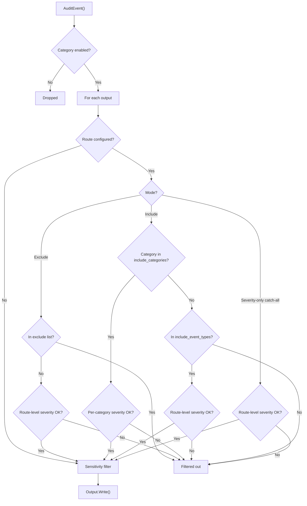

[&larr; Back to README](../README.md)

# Per-Output Event Routing

- [What Is Event Routing?](#what-is-event-routing)
- [Why Route Events?](#why-route-events)
- [Configuration](#configuration)
- [Include Mode](#include-mode)
- [Per-Category Severity Thresholds](#per-category-severity-thresholds)
- [Exclude Mode](#exclude-mode)
- [Severity Filtering](#severity-filtering)
- [Severity Precedence](#severity-precedence)
- [How Events Flow](#how-events-flow)
- [Runtime Route Changes](#runtime-route-changes)
- [Events Without Categories](#events-without-categories)

## 🔍 What Is Event Routing?

Event routing controls which events reach which outputs. Instead of
sending every event to every output, you can filter by category,
event type, or severity so that each output receives only the events
relevant to its purpose.

## ❓ Why Route Events?

A typical deployment has multiple outputs with different purposes:

- **SIEM** — needs only security-relevant events (authentication, access control)
- **Compliance file** — needs everything, unfiltered
- **Alerting webhook** — needs only high-severity events (severity 7+)
- **Debug log** — needs only write operations during development
- **Combined feed with mixed thresholds** — all `read` events for the
  audit trail AND only critical (`severity >= 7`) `security` events,
  delivered to the same output. This is the per-category-severity
  pattern; see [Per-Category Severity Thresholds](#per-category-severity-thresholds).

Without routing, every output receives every event, increasing storage
costs and noise.

## ⚙️ Configuration

Routes are configured per-output in the output YAML:

```yaml
outputs:
  # No route — receives ALL events
  full_log:
    type: file
    file:
      path: "./full-audit.log"

  # Include mode — only security events
  siem:
    type: syslog
    syslog:
      address: "syslog.example.com:514"
    route:
      include_categories:
        security: {}

  # Severity filtering — only high-severity events
  alerts:
    type: webhook
    webhook:
      url: "https://alerts.example.com/audit"
    route:
      min_severity: 7
```

## ✅ Include Mode

Only events matching the filter are delivered to this output. The
allow-list is split across two fields:

```yaml
route:
  include_categories:
    security: {}        # any event in the "security" category
    write: {}           # any event in the "write" category
  include_event_types:
    - config_change     # OR this specific event type
```

`include_categories` is a YAML **mapping** keyed by category name.
The value is either an empty mapping (`{}`, meaning "all severities
for this category") or a per-category severity filter — see the next
section.

`include_event_types` is a YAML **sequence** of event type names.

If you include both a category and an event type that belongs to that
category, the event is delivered **once** — it is not duplicated.

## 🎯 Per-Category Severity Thresholds

Each entry in `include_categories` can carry its own
`min_severity` / `max_severity` bound, expressed as a YAML mapping
value. This lets a single route express filters that vary by
category — for example, "all `read` events for the audit trail AND
only critical (severity ≥ 7) `security` events" — in one place:

```yaml
route:
  include_categories:
    security:
      min_severity: 7      # only severity-7+ security events
    read: {}               # all read events, any severity
```

A nil filter (the empty mapping `{}`) means "no severity constraint
for this category" — every event in that category is delivered. A
mapping with `min_severity` and/or `max_severity` constrains
deliveries to events in that severity band.

Per-category severity is **authoritative for category matches**.
Route-level `min_severity` / `max_severity` (the `severity-only`
section below) does NOT apply to events matched by category — only
to events matched by `include_event_types` and to the
severity-only catch-all. See [Severity Precedence](#severity-precedence)
for the full rule.

### Three modes at a glance

```yaml
# Mode A — category only (any severity)
route:
  include_categories:
    read: {}
    write: {}

# Mode B — per-category severity
route:
  include_categories:
    security:
      min_severity: 7
    read: {}

# Mode C — severity only (catch-all, no categories)
route:
  min_severity: 9
```

## ❌ Exclude Mode

All events are delivered **except** those matching the filter:

```yaml
route:
  exclude_categories: [read]             # everything except "read" events
  exclude_event_types: [health_check]    # AND exclude this specific event
```

> **Include and exclude are mutually exclusive.** You cannot use both
> on the same route. Setting both causes a startup error.

## 📊 Severity Filtering

Filter by severity range (0-10 scale). Events outside the range are
not delivered to this output:

```yaml
route:
  min_severity: 7    # only severity 7 and above
  max_severity: 10   # optional upper bound (default: no upper limit)
```

If only `min_severity` is set, all events at or above that severity
pass. If only `max_severity` is set, all events at or below that
severity pass.

## 🔗 Severity Precedence

A route can carry route-level severity bounds (`min_severity` /
`max_severity` at the top level of the `route:` block) and per-category
bounds (`min_severity` / `max_severity` inside a category entry of
`include_categories`). The two scopes serve different purposes:

| Match path | Severity bound applied |
|---|---|
| Event's category is a key in `include_categories` | **Per-category** filter (or pass-all if nil) |
| Event's type is in `include_event_types` | Route-level `min_severity` / `max_severity` |
| Exclude mode (`exclude_categories` / `exclude_event_types`) | Route-level `min_severity` / `max_severity` |
| Severity-only catch-all (no include / exclude lists) | Route-level `min_severity` / `max_severity` |

A category match never falls back to route-level severity. If the
event's category is a key in `include_categories` and the per-category
filter is nil, **all severities pass for that category**, even if the
route also has a `min_severity` set. To restrict that category by
severity, put the bound inside its mapping value.

### Example: per-category severity AND event-type fallback

```yaml
route:
  include_categories:
    security:
      min_severity: 7      # security events must be severity ≥ 7
    read: {}               # read events of any severity
  include_event_types:
    - admin_action         # admin_action of any category, but
  min_severity: 5          #   only at severity ≥ 5
```

- A `security` event at severity 8 → delivered (matches `security`, per-cat 7 OK).
- A `security` event at severity 3 → dropped (per-cat 7 fails).
- A `read` event at severity 0 → delivered (matches `read`, nil filter).
- An `admin_action` event in some other category at severity 6 → delivered
  (matches `include_event_types`, route-level 5 OK).
- An `admin_action` event at severity 4 → dropped (route-level 5 fails).

### Example: exclude with route-level severity floor

```yaml
route:
  exclude_categories:
    - read
  min_severity: 5
```

Delivers events NOT in the "read" category **AND** at severity ≥ 5.
Low-severity write events (severity 3) are filtered out even though
they pass the exclude check. Exclude mode does not support per-category
severity — there is one route-level bound for the whole exclude list.

## 🔧 How Events Flow



An event must pass the category check AND the per-output route filter
to reach an output. If an output has no route configured, it receives
all events. The severity check varies by match path — see
[Severity Precedence](#severity-precedence).

## 🔄 Runtime Route Changes

Routes can be modified at runtime without restarting the auditor:

```go
// Restrict an output to security events only.
err := auditor.SetOutputRoute("siem", &audit.EventRoute{
    IncludeCategories: map[string]*audit.SeverityRange{
        "security": nil, // any severity
    },
})

// Restrict to high-severity security events.
sev7 := 7
err = auditor.SetOutputRoute("siem", &audit.EventRoute{
    IncludeCategories: map[string]*audit.SeverityRange{
        "security": {MinSeverity: &sev7},
    },
})

// Remove the route — output receives all events again.
err = auditor.ClearOutputRoute("siem")

// Query the current route.
route, err := auditor.OutputRoute("siem")
```

The output name must match the key used in your output YAML
configuration (e.g., `"siem"`, `"alerts"`, `"full_log"`).

Route changes are thread-safe and take effect immediately for the
next event processed by the drain goroutine.

See [Progressive Example: Event Routing](../examples/10-event-routing/)
for runtime route changes in a working application.

## 📋 Events Without Categories

Events that are not assigned to any category in the taxonomy are
always delivered at the global level — they cannot be disabled via
`DisableCategory()` since they have no category. However, they CAN
be disabled via `DisableEvent("event_name")` which targets the
specific event type regardless of category membership.

They can also be filtered by per-output routes using
`exclude_event_types` or severity filtering. They also pass
`include_event_types` if explicitly listed.

Category-based include/exclude routes do not affect uncategorised
events — an `include_categories: {security: {}}` route will NOT
deliver uncategorised events (they are not in the "security" category).

## 🔁 Schema Note: include_categories is a Mapping

`include_categories` is a YAML **mapping**, not a sequence. The
older list form `include_categories: [security, read]` is no longer
accepted and will fail to parse with the goccy/go-yaml error
`sequence was used where mapping is expected` at the relevant line.
Migrate to:

```yaml
include_categories:
  security: {}
  read: {}
```

An empty inline mapping (`{}`) and an explicit `null`/`~` are both
accepted as "no severity constraint for this category" and are
normalised to a nil value at parse time.

## ⚡ Performance Note

The matching path is a single map lookup followed by at most two
pointer dereferences — zero allocations on the event hot path.
`include_categories` is the map directly (no parallel pre-computed
set), so route matching is O(1) regardless of category count. See
`BENCHMARKS.md` for measured cost.

## 📚 Further Reading

- [Progressive Example: Event Routing](../examples/10-event-routing/) — complete routing configuration
- [Outputs](outputs.md) — output types and fan-out architecture
- [Output Configuration YAML](output-configuration.md) — full YAML reference
- [API Reference: EventRoute](https://pkg.go.dev/github.com/axonops/audit#EventRoute)
- [API Reference: SeverityRange](https://pkg.go.dev/github.com/axonops/audit#SeverityRange)
