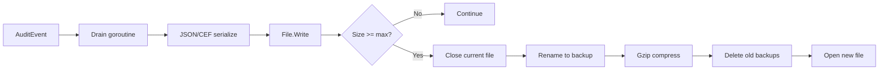

[← Back to Output Types](outputs.md)

# File Output — Detailed Reference

The file output writes one audit event per line to a local file. Files
rotate automatically when they reach a configured size. Rotated files
are compressed with gzip and retained up to a configured count and age.

- [Why File Output for Audit Logging?](#why-file-output-for-audit-logging)
- [Quick Start](#quick-start)
- [How It Works](#how-it-works)
- [Complete Configuration Reference](#complete-configuration-reference)
- [File Rotation](#file-rotation)
- [Coexistence with logrotate](#coexistence-with-logrotate)
- [Permissions and Security](#permissions-and-security)
- [Metrics and Monitoring](#metrics-and-monitoring)
- [Production Configuration](#production-configuration)
- [Troubleshooting](#troubleshooting)
- [Related Documentation](#related-documentation)

## Why File Output for Audit Logging?

Local file output provides the simplest form of persistent, durable
audit logging:

- **Compliance retention** — store a complete, unfiltered audit trail
  for regulatory requirements (SOC 2, PCI DSS, HIPAA)
- **Offline analysis** — grep, jq, and standard Unix tools work
  directly on the audit file
- **No infrastructure dependencies** — no network, no external
  services, no single points of failure
- **Tamper evidence** — combine with [HMAC integrity](hmac-integrity.md)
  for tamper detection on the audit trail
- **Backup and archival** — rotated files can be shipped to S3, GCS, or
  tape for long-term retention

## Quick Start

```bash
go get github.com/axonops/audit/file
```

```yaml
# outputs.yaml
version: 1
app_name: "my-app"
host: "my-host"
outputs:
  audit_log:
    type: file
    file:
      path: "/var/log/audit/events.log"
```

```go
import _ "github.com/axonops/audit/file"  // registers "file" factory
```

The parent directory MUST exist — the library creates the file but not
the directory.

**[→ Progressive example](../examples/03-file-output/)**

## How It Works



1. `AuditEvent()` enqueues the event in the internal buffer
2. The drain goroutine serialises the event (JSON or CEF)
3. The serialised bytes are written to the active file
4. When the file reaches `max_size_mb`, rotation is triggered:
   - The current file is closed
   - It is renamed with a timestamp suffix (e.g.,
     `events.log-2026-04-05T12-00-00.000`)
   - If `compress: true` (default), the backup is gzip-compressed
     asynchronously
   - Backups exceeding `max_backups` count or `max_age_days` are deleted
   - A new active file is opened

## Delivery Model

The file output uses **async delivery** with an internal buffered
channel and a background `writeLoop` goroutine. `Write()` copies
the event data and enqueues it into the channel, returning
immediately.

The `writeLoop` goroutine reads from the channel and **batches**
events into a single vectored write per iteration:

1. Block on the channel for the first event.
2. Opportunistically drain up to `maxBatch = 256` more events
   without blocking — no artificial latency, a single pending
   event submits as a one-iovec batch immediately.
3. Submit all N events as one `writev(2)` syscall via the
   [iouring submodule][iouring].
4. The batch lands on the OS page cache when the syscall
   returns.

[iouring]: https://pkg.go.dev/github.com/axonops/audit/iouring

### Durability contract

On `writev(2)` return the bytes are on the **kernel page cache**.
They are visible to concurrent reads on the same host
immediately, and persisted to stable storage on the OS's own
schedule (typically 5-30 s on Linux for a default ext4 mount).

**Crash window**: a power loss between `writev(2)` return and
the kernel's next page-cache writeback can lose the most recent
batch — up to roughly 130 KiB of events at typical sizes, or
~25 ms of throughput at 10 k events/s. For most audit workloads
this is comfortably inside compliance SLAs, which are typically
measured in seconds or minutes.

### What about io_uring?

The library ships the [iouring submodule][iouring] with both
io_uring and writev strategies; file output uses the writev
strategy by default. Measured benchmarks on ext4 / NVMe showed
`writev(2)` beats `io_uring` at every batch size for the
submit-and-wait pattern the file output uses (up to 9.4× faster
at batch 1). See [ADR 0002][adr-0002] for the measurement
evidence and rationale, and [BENCHMARKS.md][bench] for the full
matrix.

[adr-0002]: adr/0002-file-output-io-uring-approach.md
[bench]: ../BENCHMARKS.md#iouring-submodule

### Per-event drops

If the internal buffer is full (destination too slow or disk
stalled), the event is dropped and `OutputMetrics.RecordDrop()`
is called. A rate-limited `slog.Warn` fires at most once per
10 seconds. Drops in the file output's buffer do not affect
other outputs.

See [Two-Level Buffering](async-delivery.md#two-level-buffering)
for the complete pipeline architecture.

## Complete Configuration Reference

| Field | Type | Default | Range | Description |
|-------|------|---------|-------|-------------|
| `path` | string | *(required)* | — | Filesystem path. Relative paths resolved to absolute at construction |
| `max_size_mb` | int | `100` | 1–10,240 (10 GB) | Rotate when the file reaches this size. Values <= 0 default to 100 |
| `max_backups` | int | `5` | 0–100 | Rotated backups to retain. 0 = keep all (no count limit). Values <= 0 default to 5 |
| `max_age_days` | int | `30` | 0–365 | Delete backups older than this. 0 = no age limit. Values <= 0 default to 30 |
| `group_readable` | bool | `false` | — | If `true`, mode is `0o640` (owner read/write + group read). If absent or `false`, mode is `0o600` (owner only). See [Permissions and Security](#permissions-and-security) for the rationale. |
| `compress` | bool | `true` | — | Gzip compress rotated backup files |
| `buffer_size` | int | `10000` | 1–100,000 | Internal async buffer capacity. Events dropped when full |

### Validation Rules

- `path` MUST NOT be empty
- Parent directory of `path` MUST exist at construction time
- **Symlinks are rejected** — the parent directory path is resolved at
  construction time and symlinks are rejected to prevent path traversal
- An existing audit log at `path` MUST have permissions equal to or
  narrower than the configured target mode (`0o600` or `0o640`); a
  broader on-disk mode is rejected with an error wrapping
  [`audit.ErrConfigInvalid`] (#436)
- An existing audit log MUST NOT have setuid, setgid, or sticky bits
  set, and MUST have a hardlink count of 1; both are treated as
  tamper indicators (#436)
- `max_size_mb`, `max_backups`, `max_age_days` are rejected if above
  their upper bounds. Zero values default to the documented defaults

### Why only two modes (#436)

Audit logs are not regular application logs. They contain
compliance-critical data — who did what, when, to which resource —
and are subject to SOX, HIPAA, and GDPR tamper-resistance
requirements. The library hardcodes two permission modes:

- **`0o600` (default)** — owner read/write only. The strictest mode;
  use this unless you have a specific reason not to.
- **`0o640` (`group_readable: true`)** — owner read/write + group
  read. Required when a SIEM forwarder (Filebeat, Promtail, Fluentd)
  runs as a separate user in the file's group.

World-readable, world-writable, or group-writable modes are
**unsupported** because they undermine compliance: world-readable
exposes audit data to any user on the host, and write access (group
or world) defeats append-only-from-a-single-writer integrity.
Operators needing finer-grained access SHOULD use POSIX ACLs at the
OS level rather than relax the library's mode.

## File Rotation

### Size-Based Trigger

Rotation is triggered when the active file exceeds `max_size_mb`
megabytes (converted to bytes: `max_size_mb × 1,024 × 1,024`). The
size check happens after each write.

### Backup Naming

Rotated files are renamed with a timestamp suffix:

```
events.log                              ← active file
events.log-2026-04-05T12-00-00.000.gz  ← most recent backup (compressed)
events.log-2026-04-04T12-00-00.000.gz  ← older backup
```

### Gzip Compression

When `compress: true` (the default), rotated backup files are
compressed with gzip asynchronously. This reduces disk usage
significantly — JSON audit events typically compress by 80–90%.

### Backup Retention

Two retention mechanisms work together:

| Mechanism | Config | Behaviour |
|-----------|--------|-----------|
| **Count-based** | `max_backups` | Keep the N most recent backups; delete the rest |
| **Age-based** | `max_age_days` | Delete backups older than N days |

Both run after each rotation. A backup is deleted if EITHER condition
is met.

Zero values do NOT disable a retention dimension — they fall back
to the documented default (`max_backups: 0` → 5, `max_age_days: 0`
→ 30). Set the value explicitly to control retention. The library
does not currently support "keep all backups forever" or "ignore
age entirely"; the maximum allowed values are `max_backups: 100`
and `max_age_days: 365`.

## Coexistence with logrotate

The audit library has its own built-in rotator (see
[File Rotation](#file-rotation) above). On Linux, operators often
also run [logrotate(8)](https://man7.org/linux/man-pages/man8/logrotate.8.html)
system-wide. **The two rotators MUST NOT both manage the same log
file** — pick one. This section explains why and helps you decide.

### Recommendation: prefer the built-in rotator

Use the audit library's built-in rotation and remove (or never
add) any `/etc/logrotate.d/` entry that targets the audit log
path. The built-in rotator:

- Owns the file descriptor end-to-end, so there is no race between
  rotation and writes.
- Is configured through the same `outputs.yaml` block as the rest
  of the file output — operators get a single pane of glass for
  retention policy.
- Is cross-platform — the same configuration works on Linux,
  macOS, and Windows.
- Compresses backups asynchronously with gzip and applies both
  count-based and age-based retention without an external cron job.

Mixing two rotators always introduces a window where one tool
moves the file out from under the other. The next two subsections
describe what happens when both are active, so operators can
recognise the symptoms.

### What goes wrong if both rotators are active

The audit library rotates by **rename + recreate**: it closes the
active file descriptor, renames the file to a timestamped backup,
then opens a fresh file at the original path. logrotate, by default,
uses a similar pattern — but the library does not get notified
when logrotate fires, and vice versa.

**Without `copytruncate`** (logrotate's default behaviour):
logrotate renames `events.log` → `events.log.1` and creates a
fresh empty `events.log` (when configured with `create`, which is
typical). The library still holds an open file descriptor on the
renamed inode and keeps writing to it — events flow into
`events.log.1`, not the new `events.log`. Operators see this as
"logrotate broke audit logging" because the active file appears
empty. To make matters worse, when the library's own size
threshold eventually fires, it renames the new `events.log`
(possibly empty, possibly partially written-to depending on
ordering) to ITS own timestamped backup and opens yet another
file at the original path. The result is two competing rotation
chains and unpredictable backup naming.

**With `copytruncate`**: logrotate copies `events.log` to
`events.log.1`, then truncates the original file in place. The
library's descriptor still points at the truncated file.
Subsequent writes append from offset 0. No events are lost, but
the library's internal size counter is now out of sync with the
on-disk file size, so size-based rotation may fire late or seem
to "skip" until the counter catches up.

In both cases the practical impact is operator surprise rather
than data loss. Avoid the surprise by avoiding the dual-rotator
configuration.

### If organisational policy mandates logrotate

Some organisations require all log files under a single rotation
policy administered by logrotate. To accept that constraint
safely:

1. Set `max_size_mb: 10240` (the maximum allowed value, 10 GB)
   so the built-in rotator effectively never fires under any
   reasonable workload.
2. Set `max_backups` and `max_age_days` to their lowest valid
   values (`max_backups: 1`, `max_age_days: 1`). The library
   does NOT support fully disabling its own retention — zero
   values fall back to the documented defaults (5 backups,
   30 days). The library will keep at least one of its own
   timestamped backups per cycle; logrotate's retention policy
   needs to allow for that.
3. Configure logrotate with `copytruncate` so file descriptors
   stay valid across rotations.
4. Accept the post-rotation size-counter drift documented above
   as the price of policy compliance.

A future SIGHUP-driven file reopen — the cleanest way to make
the audit library cooperate with logrotate `postrotate` — is
NOT yet tracked by a dedicated issue, and is post-v1.0 in any
case. The closely-related but distinct
[#174](https://github.com/axonops/audit/issues/174) tracks
config-file hot-reload (a file-system watcher for `outputs.yaml`),
not signal-driven file reopen. Until a SIGHUP-rotate hook
lands, the configuration above is the recommended workaround
for environments that cannot disable logrotate.

### Non-Linux platforms

`logrotate` is a Linux-specific tool. Windows and macOS
deployments have no equivalent and rely entirely on the library's
built-in rotator. The cross-platform write semantics (rename and
recreate via `os.Rename` + `os.OpenFile`) are identical across
platforms, so the configuration documented in
[File Rotation](#file-rotation) above is the only rotation
mechanism on these systems.

## Permissions and Security

### Symlink Rejection

The file output resolves the parent directory path and **rejects
symlinks**. This prevents path traversal attacks where a symlink could
redirect audit writes to an unintended location (e.g., `/etc/shadow`).

The symlink check occurs when the output is first constructed. If the
parent directory or any component of the path is a symlink, `New()`
returns an error.

### Default Permissions

The default permission `0600` (owner read/write) is the most secure
setting:

| Permission | Meaning | Security |
|-----------|---------|----------|
| `"0600"` | Owner read/write | **Recommended.** Only the process owner can read/write |
| `"0640"` | Owner read/write, group read | Group members can read the audit log |
| `"0644"` | Owner read/write, everyone read | All users can read — use only for non-sensitive logs |
| `"0666"` | Everyone read/write | **Dangerous.** Anyone can modify the audit trail |

The library emits a `slog.Warn` when group or world-writable
permissions are configured.

## Metrics and Monitoring

The file output recognises an optional extension interface on the
`audit.OutputMetrics` value:

```go
type RotationRecorder interface {
    RecordRotation(path string)
}
```

`RecordRotation` is called after each successful file rotation. The
`path` is the absolute filesystem path of the file that was rotated.

Wire a custom per-output metrics implementation via `file.NewFactory`
with an `audit.OutputMetricsFactory`. If your returned
`audit.OutputMetrics` value also satisfies `file.RotationRecorder`,
`RecordRotation` is invoked automatically on every rotation via
structural typing — no explicit registration required. If you don't
need file-specific metrics, the blank import
`_ "github.com/axonops/audit/file"` is sufficient.

```go
audit.RegisterOutputFactory("file", file.NewFactory(myOutputMetricsFactory))
```

### What to Monitor

| Event | Meaning | Action |
|-------|---------|--------|
| `RecordRotation` frequency increasing | File filling faster (higher event volume) | Increase `max_size_mb` or add more storage |
| Disk space alerts | Backups accumulating | Reduce `max_backups` or `max_age_days` |
| Permission denied errors | Process user changed | Verify file ownership and permissions |

## Production Configuration

### Minimum Configuration

```yaml
outputs:
  audit_log:
    type: file
    file:
      path: "/var/log/audit/events.log"
```

This uses all defaults: 100 MB rotation, 5 backups, 30-day retention,
0600 permissions, gzip compression.

### High-Volume Configuration

```yaml
outputs:
  audit_log:
    type: file
    file:
      path: "/var/log/audit/events.log"
      max_size_mb: 500
      max_backups: 20
      max_age_days: 90
      compress: true
```

### Compliance Configuration

For regulatory retention, keep more backups and longer age:

```yaml
outputs:
  compliance:
    type: file
    file:
      path: "/var/log/audit/compliance.log"
      max_size_mb: 1000
      max_backups: 100
      max_age_days: 365
      compress: true
    hmac:
      enabled: true
      salt:
        version: "2026-Q1"
        value: "${HMAC_SALT}"
      algorithm: HMAC-SHA-256
```

The [HMAC integrity](hmac-integrity.md) option adds a tamper-detection
signature to each event, providing evidence of modification.

## Troubleshooting

| Problem | Cause | Fix |
|---------|-------|-----|
| `path must not be empty` | Missing `path` in config | Add the `path` field to the file block |
| `parent directory does not exist` | Directory not created | Create the directory before starting the application |
| `symlink rejected` | Parent path contains a symlink | Use a direct path without symlinks |
| `existing file permissions … broader than required` | Pre-existing audit log at the configured path has wider permissions than `0o600` (or `0o640` if `group_readable: true`) | `chmod 0600` (or `0640`) the existing file before next startup, or move it aside |
| `existing file has setuid/setgid/sticky bits set` | Audit log file has special POSIX bits (tamper indicator) | Investigate the cause; if benign, `chmod` to clear the bits before next startup |
| `existing file has hardlink count` | Audit log shares an inode with another path | Remove the hardlink; the audit log should be a single file with `nlink=1` |
| `unknown field "permissions"` | Old YAML still uses pre-#436 `permissions:` key | Remove the line (default is `0o600`) or replace with `group_readable: true` for `0o640` |
| File not rotating | `max_size_mb` too large for event volume | Reduce `max_size_mb` or check disk space |
| Disk filling up | Too many backups or age limit too high | Reduce `max_backups` and `max_age_days` |

## Related Documentation

- [Output Types Overview](outputs.md) — summary of all five outputs
- [Output Configuration Reference](output-configuration.md) — YAML field tables
- [Progressive Example](../examples/03-file-output/) — working code with rotation
- [HMAC Integrity](hmac-integrity.md) — tamper detection for file output
- [Async Delivery](async-delivery.md) — buffer sizing and graceful shutdown
- [Deployment Guide](deployment.md) — systemd / Kubernetes / Docker patterns; parent-directory creation; permissions
