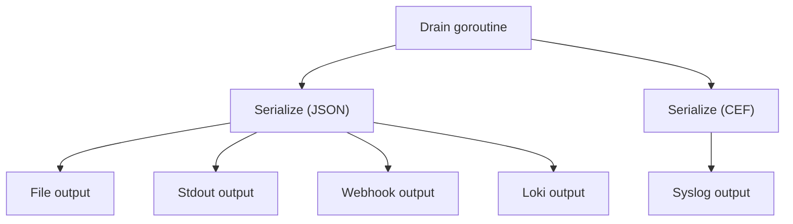

[&larr; Back to README](../README.md)

# Output Types and Fan-Out

- [What Are Outputs?](#what-are-outputs)
- [Available Outputs](#available-outputs)
- [File Output](#file-output)
- [Syslog Output](#syslog-output)
- [Webhook Output](#webhook-output)
- [Loki Output](#loki-output)
- [Stdout Output](#stdout-output)
- [Per-Output Features](#per-output-features)
- [Fan-Out Architecture](#fan-out-architecture)

## What Are Outputs?

Outputs are where your audit events end up after validation and
serialisation. audit can send the same event to multiple outputs
at once — a local file for long-term retention, a syslog server for
your SIEM, and a webhook for real-time alerting, all simultaneously.

### Optional Interfaces

Output implementations may satisfy additional optional interfaces:

| Interface | Purpose |
|-----------|---------|
| `DestinationKeyer` | Duplicate destination detection at construction |
| `DeliveryReporter` | Output handles its own delivery metrics |
| `MetadataWriter` | Receives structured event metadata (event type, severity, category, timestamp) alongside pre-serialised bytes |

`MetadataWriter` is used by outputs that need structured access to
per-event fields — for example, Loki uses event_type and severity as
stream labels. Outputs that don't implement it receive plain `Write()`
calls with no overhead.

## Why Multiple Outputs?

Different teams need audit events in different places, in different
formats, with different levels of detail:

- **Security team** — needs events in [CEF format](cef-format.md) in their SIEM, filtered to security categories
- **Compliance** — needs a complete, unfiltered file with all fields for regulatory retention
- **Operations** — needs high-severity events pushed to a webhook for alerting
- **External partners** — needs events with [PII fields stripped](sensitivity-labels.md) before delivery

Each output can have its own formatter, [event routing](event-routing.md)
filter, and [sensitivity label exclusions](sensitivity-labels.md).

## Available Outputs

| Output | Module | Transport | Key Features |
|--------|--------|-----------|--------------|
| **File** | `audit/file` | Local filesystem | Size-based rotation, gzip compression, backup retention, configurable permissions |
| **Syslog** | `audit/syslog` | TCP, UDP, TCP+TLS | RFC 5424 format, mTLS client certs, automatic reconnection |
| **Webhook** | `audit/webhook` | HTTPS | Batched delivery, retry with backoff, SSRF protection, custom headers |
| **Loki** | `audit/loki` | HTTPS | Stream labels, gzip compression, multi-tenancy, retry with backoff, SSRF protection |
| **Stdout** | `audit` (core) | Standard output | Built into the core module — no additional dependency needed |

---

## File Output

Writes one audit event per line to a local file with automatic
size-based rotation, gzip compression, and backup retention.

Key features:

- **Size-based rotation** — automatic rollover at configurable file
  size (default: 100 MB, max: 10 GB)
- **Gzip compression** — rotated backups compressed automatically
  (80–90% reduction)
- **Backup retention** — configurable count (max: 100) and age (max:
  365 days)
- **Secure permissions** — default `0600` (owner only); symlinks
  rejected to prevent path traversal
- **No infrastructure dependencies** — local filesystem only

**[→ Full File Output Reference](file-output.md)** — complete
configuration, rotation mechanics, permissions, production examples,
and troubleshooting.

**[→ Progressive example](../examples/03-file-output/)**

Install: `go get github.com/axonops/audit/file`

---

## Syslog Output

Sends events as [RFC 5424](https://datatracker.ietf.org/doc/html/rfc5424)
syslog messages over TCP, UDP, or TCP+TLS. The connection is
established immediately when the output is created — the syslog server
must be reachable at startup. TCP and TLS connections are
re-established automatically on failure with exponential backoff.

Key features:

- **Standards-based** — RFC 5424 message format with octet-counting
  framing (RFC 5425)
- **Three transports** — TCP (default), UDP, or TCP+TLS with mTLS
- **Automatic reconnection** — bounded exponential backoff (100ms to
  30s with jitter)
- **SIEM pairing** — combine with the CEF formatter for native ArcSight,
  Splunk, and QRadar integration

**[→ Full Syslog Output Reference](syslog-output.md)** — complete
configuration, TLS, reconnection, facility values, production examples,
and troubleshooting.

**[→ Progressive example with embedded TCP receiver](../examples/06-syslog-output/)**

Install: `go get github.com/axonops/audit/syslog`

---

## Webhook Output

Batches audit events as
[NDJSON](https://github.com/ndjson/ndjson-spec) (newline-delimited
JSON) and POSTs them to an HTTPS endpoint. Failed batches are retried
with exponential backoff. Private and loopback addresses are blocked
by default (SSRF protection).

Key features:

- **Batched delivery** — configurable batch size and flush interval
  reduce HTTP overhead
- **Retry with backoff** — 5xx and 429 responses trigger exponential
  backoff with jitter; `Retry-After` honoured on 429 (capped at 30s)
- **SSRF protection** — private/loopback ranges blocked by default;
  redirects rejected
- **Custom headers** — authentication tokens, correlation IDs on every
  request
- **At-least-once delivery** — batches retried on transient failure

**[→ Full Webhook Output Reference](webhook-output.md)** — complete
configuration, authentication, TLS, NDJSON format, retry logic, SSRF
protection, production examples, and troubleshooting.

**[→ Progressive example with embedded HTTP receiver](../examples/07-webhook-output/)**

Install: `go get github.com/axonops/audit/webhook`

---

## Loki Output

Pushes audit events to [Grafana Loki](https://grafana.com/oss/loki/)
via the HTTP Push API with stream labels, gzip compression,
multi-tenancy, and exponential backoff retry.

**[→ Full Loki Output Reference](loki-output.md)** — complete
configuration, stream labels, authentication, TLS, LogQL queries,
production examples, performance tuning, and troubleshooting.

### Key Features

- **Stream labels** derived from event metadata (event_type, severity,
  category) make audit events queryable via LogQL without parsing
  every log line
- **Multi-tenancy** via `X-Scope-OrgID` keeps different applications
  or environments isolated in a shared Loki cluster
- **Grafana integration** provides dashboards, alerting, and LogQL
  exploration out of the box
- **Gzip compression** reduces push payload size by ~80%
- **SSRF protection** blocks private/loopback ranges by default
- **Exponential backoff retry** on 429/5xx with `Retry-After` support

**[→ Progressive example with real query output](../examples/08-loki-output/)**

Install: `go get github.com/axonops/audit/loki`

---

## Stdout Output

Writes events to standard output. Built into the core module — no
additional `go get` needed. Useful for local development, debugging,
and piping to other tools.

### YAML Configuration

```yaml
outputs:
  console:
    type: stdout
```

No additional configuration fields are needed.

**[→ Full Stdout Output Reference](stdout-output.md)** — container
deployment, piping patterns, limitations.

**[→ Progressive example](../examples/02-code-generation/)**

---

## Per-Output Features

Every output supports these optional features:

| Feature | Where to Configure | Documentation |
|---------|-------------------|---------------|
| **Formatter** | `formatter:` block on each output | [JSON](json-format.md), [CEF](cef-format.md) |
| **Event routing** | `route:` block on each output | [Event Routing](event-routing.md) |
| **Sensitivity labels** | `exclude_labels:` on each output | [Sensitivity Labels](sensitivity-labels.md) |
| **Enable/disable** | `enabled: false` on each output | Toggle without removing config |

## Buffering and Delivery Model

Outputs fall into two categories based on how they receive events from
the core drain goroutine:

| Output | Internal Buffer | Batching | Delivery Model |
|--------|----------------|----------|----------------|
| **Stdout** | No | No | Synchronous — blocks drain goroutine until write to `os.Stdout` completes |
| **File** | Yes (`buffer_size`, default 10,000, max 100,000) | No | Async — own `writeLoop` goroutine, one-event-per-write to disk |
| **Syslog** | Yes (`buffer_size`, default 10,000, max 100,000) | No | Async — own `writeLoop` goroutine, one-message-per-write via TCP/UDP |
| **Webhook** | Yes (`buffer_size`, default 10,000, max 1,000,000) | Yes (`batch_size`, `flush_interval`) | Async — own goroutine, batched HTTP POST |
| **Loki** | Yes (`buffer_size`, default 10,000, max 1,000,000) | Yes (`batch_size`, `max_batch_bytes`, `flush_interval`) | Async — own goroutine, batched HTTP POST with gzip |

**Only stdout writes synchronously** from the drain goroutine. All
other outputs copy the event bytes into their own internal buffer and
return immediately, so a stalled destination does not block delivery
to other outputs. This output isolation is a security requirement —
a stalled syslog server must not prevent file writes, and a slow
webhook must not block Loki delivery. Without async buffers, one
failed output would silence all auditing. If the internal buffer fills, events are dropped.
`OutputMetrics.RecordDrop()` fires on every drop, and a rate-limited
`slog.Warn` fires at most once per 10 seconds. Drops in one output's
buffer do not affect other outputs.

See [Two-Level Buffering](async-delivery.md#two-level-buffering) for
the complete pipeline architecture, memory sizing, and tuning guidance.

## Fan-Out Architecture



The drain goroutine serialises each event once per unique format and
delivers to all outputs in sequence. An error returned by one output
does not prevent delivery to others — the drain loop continues.
Only stdout writes synchronously. All other outputs return
immediately from `Write()`, so a stalled destination does not delay
delivery to other outputs. See
[Buffering and Delivery Model](#buffering-and-delivery-model) above.

## Failure Mode Matrix

How does each output behave when the destination misbehaves? The
matrix below documents the concrete behaviour, the metric counter
that increments, and the recommended operator action. The
behaviours have been verified against the per-output BDD scenarios
in [`tests/bdd/features/`](../tests/bdd/features/) (#562).

| Failure | Stdout | File | Syslog | Webhook | Loki |
|---|---|---|---|---|---|
| **Destination down** (TCP refused, file path missing, 502) | Synchronous write to `os.Stdout`; on FD-closed-by-OS the drain goroutine logs the error and continues. | `Writev` returns an I/O error (e.g. `ENOENT`, `EIO`); `RecordError` once per failed batch; the entire batch (up to 256 events) is dropped; the drain loop continues. | TCP dial fails; reconnect with exponential backoff (100ms→30s, capped by `max_retries`); `RecordRetry` per attempt; on exhaustion `RecordError` and drop **that event** (the remaining entries in the batch continue processing). | HTTP 5xx / connect-refused: retry with exponential backoff (100ms→5s, `max_retries`); `RecordRetry`; on exhaustion `RecordError` and `RecordDrop` per event in the batch. | Identical to webhook (HTTP). |
| **Destination slow** (TCP send-window stall, slow read, multi-second response) | Blocks the drain goroutine — every event waits for stdout. **Avoid stdout in production hot paths**. | `writev` blocks on kernel page cache; per-output goroutine isolates the drain loop; if buffer fills, `RecordDrop`. | Per-output goroutine queues messages; if buffer fills, `RecordDrop`. Reconnect logic is non-blocking on the drain goroutine. | Per-output goroutine; `Timeout` (default `10s`) caps total per-batch latency; `ResponseHeaderTimeout` caps slow reads; on buffer full `RecordDrop`. | Identical to webhook with the additional gzip-compressed batch. |
| **Auth failure** (401/403, bad token, bad client cert) | N/A — stdout has no auth. | N/A — file has no auth (use POSIX permissions). | TLS handshake fails on reconnect → treated as a transient network error; retry exhausts; `RecordError` and drop. Cert reload requires process restart. | 401/403 are **non-retryable**; single attempt, immediate `RecordError` and drop. | Identical to webhook. |
| **Disk full** (`ENOSPC`) | If the stdout FD points to a filesystem at capacity, the write blocks the drain goroutine; same risk as "destination slow". | `writev` returns `ENOSPC`; `RecordError`; event dropped from internal buffer; rotation cleanup may reclaim space on next eligible rotation. With `fsync_each_batch: true` (#678), `fsync(2)` may also return `ENOSPC` after a successful `writev(2)` — same `RecordError` shape; see [fsync failures](error-reference.md#file-output-fsync_each_batch-failures-678). | N/A — network-only. | N/A — no on-disk spool. | N/A — no on-disk spool. |
| **TLS expired** (peer or client cert past notAfter) | N/A — stdout has no TLS. | N/A — file has no TLS. | TLS handshake fails on next reconnect; retried as a transient network error (100ms→30s, `max_retries`); `RecordError` on exhaustion. **Certs are loaded once at startup — operators MUST restart the process after certificate renewal.** | TLS handshake error returned from `client.Do`; classified retryable (the webhook treats every non-redirect, non-cancelled `client.Do` error as transient); retried 100ms→5s up to `max_retries`; then `RecordError` and `RecordDrop` per event. **Restart required after certificate renewal.** | Identical to webhook. |
| **DNS failure** (NXDOMAIN, resolver timeout) | N/A — stdout has no DNS. | N/A — file has no DNS. | Treated as a transient dial error; retry with backoff (100ms→30s, `max_retries`); `RecordRetry` per attempt; `RecordError` on exhaustion. | Treated as transient (Go `net` error); retry 100ms→5s, `max_retries`; `RecordRetry` / `RecordError`. | Identical to webhook. |
| **Rate-limited** (HTTP 429 / 503 with `Retry-After`) | N/A — stdout has no rate-limiting. | N/A — file has no rate-limiting. | N/A — RFC 5424 syslog has no rate-limit response; transport-level errors fold into "destination slow". | 429 is retryable; webhook **parses the `Retry-After` header** (delta-seconds form, capped at 30s) and waits `max(computed_backoff, Retry-After)`. 5xx is retryable on backoff only (no header parsing). `RecordRetry`; `RecordError` on exhaustion. | 429 is retryable; loki **parses the `Retry-After` header** (capped at 30s) and waits `max(computed_backoff, Retry-After)`. 5xx is retryable on backoff only (no header parsing). `RecordRetry`; `RecordError` on exhaustion. |
| **Startup probe fails** (destination unreachable, TLS handshake error, SSRF policy reject) | N/A — stdout has no destination to probe. | N/A — `os.OpenFile` already fails fast on permission / missing directory. | `New()` returns an error wrapped with `audit/syslog: startup verification failed for <network>://<address>: <cause>` (#286). Default behaviour; opt-out via `verify_on_startup: false`. The application MUST NOT start with a broken audit destination — silent loss is worse than a startup failure. | `New()` returns an error wrapped with `audit/webhook: startup verification failed for <scheme>://<host>: <cause> (set verify_on_startup: false to skip)`. Opt-out for sidecar/lazy-start receivers. SSRF policy applies to the probe identically to runtime. | Identical to webhook. |

### Metric counters

The matrix references these counters from the
`OutputMetrics` interface (see [Metrics & Monitoring](metrics-monitoring.md)):

| Counter call | Increments when |
|---|---|
| `RecordDrop()` | The output's internal buffer is full and an event cannot be queued; for webhook and loki, also called per event when retries are exhausted |
| `RecordError()` | A non-retryable delivery failure occurred (e.g., 401/403, retry budget exhausted) |
| `RecordFlush(batchSize, dur)` | A batch was successfully delivered |
| `RecordRetry(attempt)` | A retry attempt is starting (1-indexed) |
| `RecordQueueDepth(depth, capacity)` | Sampled per-output buffer pressure |

### Operator actions by failure mode

- **Destination down** — verify the destination is running and the network path is open. Check `RecordError` rate; for syslog/webhook/loki, raise `max_retries` only if you can tolerate the additional latency; for file, ensure the parent directory exists and the process has write permission.
- **Destination slow** — watch `RecordQueueDepth` trending toward `capacity`; raise `buffer_size`, lower `batch_size`, or move the destination closer (separate NIC, dedicated network path). For stdout in particular, redirect to a fast sink (a file, a pipe to `journald`) before production.
- **Auth failure** — check the credential source. For Vault/OpenBao secrets, verify the lease is still valid. After cert renewal, **restart the process** — the audit library does not hot-reload TLS material.
- **Disk full** — for file output, free space immediately; rotation cleanup is opportunistic, not a substitute. For stdout pointed at a full filesystem, redirect stdout elsewhere.
- **TLS expired** — renew certificates and **restart the process**. Add cert-expiry alerting upstream of the audit library.
- **DNS failure** — `nslookup` / `dig` the destination; check `/etc/resolv.conf`. Persistent DNS failure is usually a network-team escalation. The audit library will keep retrying.
- **Rate-limited** — reduce per-instance load (lower `batch_size`, increase `flush_interval`, add jitter at startup if a fleet-wide spike causes synchronised retries). Both loki and webhook honour the `Retry-After` header on 429 (capped at 30s) and apply whichever is longer — the parsed value or the computed backoff. Aggressive operator action is rarely needed beyond load tuning.
- **Startup probe fails** — the destination is misconfigured or genuinely unreachable. Check the URL/address and network path. For sidecar deployments where the destination comes up after the application (the standard reason for a benign startup-probe failure), set `verify_on_startup: false` on that output; the runtime retry path will deliver events once the destination becomes available. If the failure is SSRF-related (the probe rejected a private address by default), set `allow_private_ranges: true` only if the destination is operator-owned inside the same network policy zone — see [SSRF Protection](webhook-output.md#ssrf-protection).

For a deeper failure-mode walkthrough by *symptom*, see
[Troubleshooting](troubleshooting.md). For deployment-level
recovery topology (separate `RetentionWriter`, dual-output
strategies, K8s liveness wiring) see
[Deployment](deployment.md).

## Further Reading

- [Progressive Example: File Output](../examples/03-file-output/)
- [Progressive Example: Multi-Output](../examples/09-multi-output/)
- [Progressive Example: Capstone](../examples/20-capstone/) — four outputs with HMAC, CEF, Loki, and PII stripping
- [Output Configuration YAML](output-configuration.md) — full YAML reference
- [Troubleshooting](troubleshooting.md) — failure symptoms and recovery
- [Metrics & Monitoring](metrics-monitoring.md) — full metric reference
