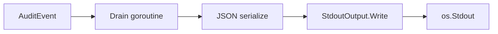

[← Back to Output Types](outputs.md)

# Stdout Output — Detailed Reference

The stdout output writes serialised audit events to standard output,
one JSON line per event. It is the simplest output in audit — built
into the core module with no configuration options and no additional
dependencies.

- [When to Use Stdout](#when-to-use-stdout)
- [Quick Start](#quick-start)
- [How It Works](#how-it-works)
- [Configuration](#configuration)
- [Container and Kubernetes Deployment](#container-and-kubernetes-deployment)
- [Piping and Filtering](#piping-and-filtering)
- [Limitations](#limitations)
- [Troubleshooting](#troubleshooting)
- [Related Documentation](#related-documentation)

## When to Use Stdout

Stdout is the right choice when you need **immediate visibility** of
audit events without configuring external infrastructure:

| Scenario | Why stdout works |
|----------|-----------------|
| **Local development** | See events in your terminal as they happen |
| **Debugging in staging** | Inspect events without reconfiguring outputs |
| **Container logging** | Docker and Kubernetes capture stdout automatically ([twelve-factor app](https://12factor.net/logs) pattern) |
| **CI/CD pipelines** | Assert on program output in tests |
| **Quick prototyping** | Get started without setting up files, syslog, or HTTP endpoints |

For **production retention**, use [file output](outputs.md#file-output). For
**SIEM integration**, use [syslog](outputs.md#syslog-output) or
[webhook](outputs.md#webhook-output). For **structured querying**, use
[Loki](loki-output.md).

## Quick Start

Stdout is part of the core `github.com/axonops/audit` module — no
additional `go get` is needed for the output itself. To load YAML
configuration, you also need the `outputconfig` module:

```bash
go get github.com/axonops/audit
go get github.com/axonops/audit/outputconfig
```

### Direct Go construction

Three non-panicking convenience constructors cover the common cases:

```go
import audit "github.com/axonops/audit"

out, err := audit.NewStdout()                // writes to os.Stdout
out, err := audit.NewStderr()                // writes to os.Stderr
out, err := audit.NewWriter(&bytes.Buffer{}) // writes to any io.Writer
```

All three return `(*audit.StdoutOutput, error)`; none panic.

### YAML configuration

```yaml
# outputs.yaml
version: 1
app_name: "my-app"
host: "my-host"
outputs:
  console:
    type: stdout
```

To make the YAML `type: stdout` form work, register the stdout factory.
Either blank-import the convenience package (registers all five output
types at once):

```go
import (
    audit "github.com/axonops/audit"
    "github.com/axonops/audit/outputconfig"
    _ "github.com/axonops/audit/outputs" // registers stdout + file + syslog + webhook + loki
)
```

…or register only stdout explicitly:

```go
import audit "github.com/axonops/audit"

audit.RegisterOutputFactory("stdout", audit.StdoutFactory())
```

Prior to v0.x (#578) the core package auto-registered the stdout
factory via a hidden `init()`. That was removed to eliminate import-
time global mutation; opt in explicitly using one of the two patterns
above.

**[→ Progressive example with code and output](../examples/02-code-generation/)**

## How It Works



1. `AuditEvent()` enqueues the event in the internal buffer
2. The drain goroutine dequeues and serialises the event as JSON
3. `StdoutOutput.Write()` acquires a mutex and writes to `os.Stdout`
4. The event appears on the process's standard output

The drain goroutine is the sole writer — `StdoutOutput.Write()` is
called sequentially from the drain loop, not concurrently. The mutex
guards against concurrent `Close()` calls.

**Important:** You MUST call `auditor.Close()` before your program
exits. Close drains the internal buffer and flushes all pending events.
Without it, events still in the buffer are lost silently.

## Delivery Model

The stdout output writes **synchronously** from the core drain
goroutine. It has no internal buffer or batching — each event is
written directly to `os.Stdout` as soon as the drain goroutine
processes it.

In practice, stdout writes are very fast and rarely a bottleneck.
`StdoutOutput.Write()` acquires a mutex internally to guard against
concurrent `Close()` calls, but since the drain goroutine is the sole
writer, this mutex never contends during normal operation. If stdout
is piped to a slow consumer or a full pipe buffer, it will delay
delivery to all other outputs.

See [Two-Level Buffering](async-delivery.md#two-level-buffering) for
the complete pipeline architecture.

## Configuration

The stdout output accepts **no type-specific configuration**:

```yaml
outputs:
  console:
    type: stdout
    # No stdout: block — any additional fields are rejected.
```

If you add a `stdout:` configuration block, the library returns an
error:

```
audit: stdout output "console": stdout does not accept configuration
```

### Per-Output Features

Like all outputs, stdout supports these optional features:

| Feature | Supported | Notes |
|---------|-----------|-------|
| **Formatter** | Yes | `formatter:` block (JSON default, CEF available) |
| **Event routing** | Yes | `route:` block (include/exclude categories, severity) |
| **Sensitivity labels** | Yes | `exclude_labels:` (strip fields before output) |
| **HMAC integrity** | Yes | `hmac:` block (append HMAC to each event) |
| **Enable/disable** | Yes | `enabled: false` to toggle |

Example with routing and a formatter:

```yaml
outputs:
  security_console:
    type: stdout
    formatter:
      type: cef
      vendor: "MyCompany"
      product: "MyApp"
      version: "1.0"
    route:
      include_categories:
        security: {}
```

## Container and Kubernetes Deployment

In containerised environments, stdout is often the **primary** output.
Container runtimes capture stdout and route it to their logging
infrastructure:

- **Docker**: `docker logs <container>` captures stdout
- **Kubernetes**: Pod logs (`kubectl logs`) capture stdout; log
  aggregators (Fluentd, Promtail, Vector) collect from the node
- **AWS ECS/Fargate**: stdout routed to CloudWatch Logs via the
  `awslogs` driver

This follows the [twelve-factor app](https://12factor.net/logs)
principle: the application emits events to stdout and the execution
environment handles routing, aggregation, and retention.

### Multi-Output with Stdout

In production containers, you might use stdout alongside a persistent
output:

```yaml
outputs:
  container_logs:
    type: stdout
  compliance_file:
    type: file
    file:
      path: "/var/log/audit/events.log"
      max_size_mb: 100
      compress: true
```

This gives you both real-time `kubectl logs` visibility and persistent
file retention.

## Piping and Filtering

Since stdout produces one JSON object per line
([NDJSON](https://github.com/ndjson/ndjson-spec)), standard Unix tools
work directly:

```bash
# Pretty-print all events
go run . 2>/dev/null | jq .

# Filter by event type
go run . 2>/dev/null | jq 'select(.event_type == "auth_login")'

# Filter by category
go run . 2>/dev/null | jq 'select(.event_category == "security")'

# Count events by type
go run . 2>/dev/null | jq -s 'group_by(.event_type) | map({type: .[0].event_type, count: length})'

# Extract specific fields
go run . 2>/dev/null | jq '{event_type, actor_id, outcome}'

# Search with grep (faster than jq for simple patterns)
go run . 2>/dev/null | grep '"event_type":"auth_login"'
```

## Limitations

| Limitation | Impact | Alternative |
|------------|--------|-------------|
| No rotation | Unbounded output; consuming process MUST handle volume | [File output](outputs.md#file-output) with `max_size_mb` |
| No retry | Failed writes are lost (broken pipe, full buffer) | [Webhook](outputs.md#webhook-output) or [Loki](loki-output.md) with retry |
| No compression | Every byte written as-is | [File output](outputs.md#file-output) with `compress: true` |
| No persistence | Process crash loses buffered events | [File output](outputs.md#file-output) or [syslog](outputs.md#syslog-output) |
| No TLS | Events visible to anyone with access to stdout | [Syslog](outputs.md#syslog-output) with TCP+TLS or [webhook](outputs.md#webhook-output) with HTTPS |
| Writer not closed | `StdoutOutput.Close()` does NOT close `os.Stdout` | By design — closing stdout would break the process |

## Troubleshooting

| Problem | Cause | Fix |
|---------|-------|-----|
| `stdout does not accept configuration` | Added a `stdout:` block in YAML | Remove the type-specific block; stdout takes no config |
| Events not appearing | Auditor not closed before program exits | You MUST call `auditor.Close()` to flush the drain buffer |
| Events interleaved with log output | `log.Printf` writes to stderr by default, but some setups redirect both | Use `2>/dev/null` when piping, or configure log output to a file |
| JSON not parseable by jq | Multiple outputs writing to stdout, or log messages mixed in | Ensure only one stdout output; redirect log to stderr or file |

## Related Documentation

- [Output Types Overview](outputs.md) — summary of all five outputs
- [Output Configuration Reference](output-configuration.md) — YAML field tables
- [Progressive Example](../examples/02-code-generation/) — working code with piping examples
- [File Output](outputs.md#file-output) — persistent alternative with rotation
- [Async Delivery](async-delivery.md) — buffer sizing and graceful shutdown
