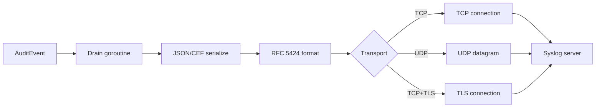
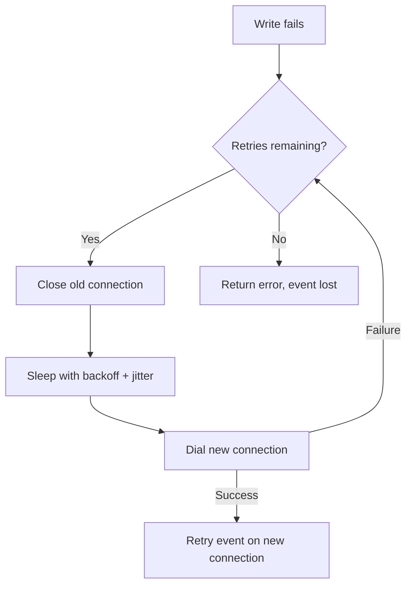

[← Back to Output Types](outputs.md)

# Syslog Output — Detailed Reference

The syslog output sends audit events as
[RFC 5424](https://datatracker.ietf.org/doc/html/rfc5424) structured
syslog messages over TCP, UDP, or TCP+TLS (including mTLS). Events are
formatted with proper syslog headers and the serialised audit payload
(JSON or CEF) as the message body.

- [Why Syslog for Audit Logging?](#why-syslog-for-audit-logging)
- [Quick Start](#quick-start)
- [How It Works](#how-it-works)
- [RFC 5424 Message Format](#rfc-5424-message-format)
- [Transport Options](#transport-options)
- [Complete Configuration Reference](#complete-configuration-reference)
- [TLS and mTLS Configuration](#tls-and-mtls-configuration)
- [Automatic Reconnection](#automatic-reconnection)
- [Facility Values](#facility-values)
- [CEF Formatter Pairing](#cef-formatter-pairing)
- [Metrics and Monitoring](#metrics-and-monitoring)
- [Production Configuration](#production-configuration)
- [Troubleshooting](#troubleshooting)
- [Related Documentation](#related-documentation)

## Why Syslog for Audit Logging?

Syslog is the standard protocol for centralised log collection. Nearly
every SIEM, log aggregator, and compliance platform supports syslog
ingestion natively:

- **Universal SIEM compatibility** — Splunk, ArcSight, QRadar, Elastic,
  Graylog, and LogRhythm all accept syslog
- **Standards-based** — [RFC 5424](https://datatracker.ietf.org/doc/html/rfc5424)
  defines the message format;
  [RFC 5425](https://datatracker.ietf.org/doc/html/rfc5425) defines TLS
  transport;
  [RFC 5426](https://datatracker.ietf.org/doc/html/rfc5426) defines UDP
  transport
- **Infrastructure already exists** — most organisations already run
  syslog infrastructure (rsyslog, syslog-ng) that can receive events
  without deploying new services
- **Compliance requirement** — PCI DSS, SOC 2, and HIPAA often require
  centralised audit log collection via syslog

## Quick Start

```bash
go get github.com/axonops/audit/syslog
```

```yaml
# outputs.yaml
version: 1
app_name: "my-app"
host: "my-host"
outputs:
  siem:
    type: syslog
    syslog:
      address: "syslog.internal:514"
```

```go
import _ "github.com/axonops/audit/syslog"  // registers "syslog" factory
```

The syslog server MUST be reachable at startup — the connection is
established immediately when the output is created.

**[→ Progressive example with embedded TCP receiver](../examples/07-syslog-output/)**

## How It Works



1. `AuditEvent()` enqueues the event in the internal buffer
2. The drain goroutine serialises the event (JSON or CEF)
3. The serialised bytes are wrapped in an RFC 5424 syslog message
4. The message is sent over the configured transport (TCP, UDP, or
   TCP+TLS)
5. On TCP/TLS failure, the output reconnects automatically with
   exponential backoff

## RFC 5424 Message Format

Each audit event is wrapped in an RFC 5424 structured syslog message:

```
<PRIORITY>VERSION TIMESTAMP HOSTNAME APP-NAME PROCID MSGID SD MSG
```

Example (annotated):

```
<134>1 2026-04-05T12:00:00.123456789+02:00 prod-web-01 my-app 45678 my-app - {"event_type":"auth_login",...}
```

| Field | Value | Source |
|-------|-------|--------|
| `PRIORITY` | `<134>` | Facility (local0=16) × 8 + Severity (mapped from audit event severity) |
| `VERSION` | `1` | Always RFC 5424 version 1 |
| `TIMESTAMP` | `2026-04-05T12:00:00.123456789+02:00` | RFC 3339 with nanosecond precision |
| `HOSTNAME` | `prod-web-01` | From `Config.Hostname` or `os.Hostname()` |
| `APP-NAME` | `my-app` | From `Config.AppName`, else top-level `app_name` (cascade), else default `"audit"`. See [APP-NAME Cascade](#app-name-cascade). |
| `PROCID` | `45678` | Process ID at construction time |
| `MSGID` | `my-app` | Same as APP-NAME |
| `SD` | `-` | No structured data elements |
| `MSG` | `{"event_type":...}` | The serialised audit event (JSON or CEF) |

### Understanding the PRIORITY Field

Every syslog message starts with a number in angle brackets like
`<133>`. This is the **PRIORITY** (PRI) field. It tells the syslog
receiver two things about the message:

1. **Where it came from** (the "facility")
2. **How important it is** (the "severity")

These two values are packed into a single number using the formula:

**`PRI = facility × 8 + severity`**

You don't need to calculate this yourself — audit handles it
automatically. But understanding it helps when reading syslog output
or configuring your SIEM's filtering rules.

### What Is a Facility?

A **facility** is a syslog concept that identifies which part of a
system generated a message. Think of it as a "channel" or "category"
that syslog receivers use to route messages to different log files,
dashboards, or alert pipelines.

Syslog was originally designed for Unix systems, so facilities include
things like `kern` (kernel), `mail` (mail server), and `cron`
(scheduled tasks). Most of these are irrelevant for audit logging.

The ones that matter for your application are `local0` through
`local7`. These are eight facilities specifically reserved for custom
applications — they have no predefined meaning, so you can use them
however you want. For example:

- `local0` — your audit events (the default)
- `local1` — your application's operational logs
- `local2` — a different service's audit events

Your syslog receiver (rsyslog, syslog-ng, Splunk) can then route
messages based on facility. For example, in rsyslog:

```
# Route local0 messages (audit events) to a dedicated file
local0.*  /var/log/audit/events.log

# Route local1 messages (operational logs) elsewhere
local1.*  /var/log/app/operational.log
```

You configure the facility in your `outputs.yaml`:

```yaml
syslog:
  facility: "local0"   # default — use local0 through local7
```

If you only have one audit stream, the default `local0` is fine. You
never need to change it unless your syslog administrator asks you to
use a specific facility for routing purposes.

**Facility reference:**

| Name | Number | Use |
|------|--------|-----|
| `local0` (default) | 16 | Custom use — recommended for audit logging |
| `local1`–`local7` | 17–23 | Additional custom channels |
| `auth` | 4 | Authentication subsystem (OS-level) |
| `authpriv` | 10 | Private authentication messages |
| `daemon` | 3 | System daemons |

### How Severity Mapping Works

audit automatically maps the audit event severity from your taxonomy
(a number 0-10) to the syslog severity scale (0-7). The syslog scale
is inverted — lower numbers are MORE critical:

| Your Taxonomy Severity | Syslog Severity | Name | What It Means |
|----------------------|----------------|------|---------------|
| 10 | 2 | Critical | A critical security event (e.g., data breach) |
| 8-9 | 3 | Error | High-severity event (e.g., `auth_failure`) |
| 6-7 | 4 | Warning | Medium-severity event (e.g., configuration change) |
| 4-5 | 5 | Notice | Normal operational event (e.g., `user_create`) |
| 1-3 | 6 | Informational | Low-severity event (e.g., read operations) |
| 0 | 7 | Debug | Debug/trace events |

Syslog severity levels 0 (Emergency) and 1 (Alert) are intentionally
never used — they are reserved for system-level emergencies like kernel
panics or hardware failures, and can trigger console broadcasts and
pager alerts on many syslog receivers.

### Putting It Together: PRI Calculation

With the default facility `local0` (number 16):

| Event | Taxonomy Severity | Syslog Severity | PRI = 16×8 + sev | Message starts with |
|-------|------------------|----------------|------------------|-------------------|
| `user_create` | 5 | 5 (Notice) | 133 | `<133>` |
| `auth_failure` | 8 | 3 (Error) | 131 | `<131>` |
| `config_change` | 7 | 4 (Warning) | 132 | `<132>` |

This means your SIEM can filter events by syslog severity without
parsing the JSON body:
- `auth_failure` arrives as syslog Error → triggers alerts
- `user_create` arrives as syslog Notice → goes to standard audit log
- `config_change` arrives as syslog Warning → goes to change
  management dashboard

**Important:** The audit payload is placed in the MSG portion, not in
SD (structured data) elements. This means no SD-escaping is required
and the payload is delivered exactly as serialised.

### TCP Framing

On TCP, messages use
[RFC 5425](https://datatracker.ietf.org/doc/html/rfc5425)
octet-counting framing: each message is prefixed with its byte length
followed by a space:

```
357 <134>1 2026-04-05T12:00:00+02:00 ...
```

This allows the receiver to unambiguously parse message boundaries,
even when messages contain newlines.

## APP-NAME Cascade

Two YAML keys share the name `app_name`:

- **Top-level** `app_name:` — the framework field set on every audit
  event and used as the default for per-output contexts.
- **Per-output** `outputs.<name>.syslog.app_name:` — the literal
  RFC 5424 APP-NAME header field for the outgoing syslog message.

These are distinct concepts (event-level vs protocol-header) but
in most deployments operators want them to match. To avoid duplicate
configuration, the syslog output follows this cascade at construction:

1. **Per-output** `outputs.<name>.syslog.app_name` wins if set.
2. Otherwise **top-level** `app_name` cascades in automatically.
3. Otherwise the literal default `"audit"` is used.

```yaml
version: 1
app_name: billing-service    # framework event field + syslog APP-NAME default
host: billing-prod-eu-1
outputs:
  siem:
    type: syslog
    syslog:
      network: tcp
      address: "siem.corp:514"
      # app_name omitted → RFC 5424 APP-NAME = "billing-service"

  soc-override:
    type: syslog
    syslog:
      network: tcp
      address: "soc.corp:514"
      app_name: "billing-audit"   # per-output override wins for this destination
```

Use the override when one audit process fans out to multiple syslog
destinations that each need a different APP-NAME (a SOC SIEM keyed
on `"billing-audit"` while the primary SIEM keys on the framework
name). When every destination wants the same APP-NAME, set only the
top-level `app_name` and the cascade fills every syslog header in.

The cascade is implemented at output-factory time — the first
connection already uses the resolved APP-NAME. No reconnect or
post-construction update is needed.

## Transport Options

| Transport | `network:` | Port | Reliability | Encryption | Use case |
|-----------|-----------|------|-------------|------------|----------|
| **TCP** | `"tcp"` | 514 | Reliable, connection-based | None | Internal networks, trusted environments |
| **UDP** | `"udp"` | 514 | Best-effort, fire-and-forget | None | High-volume, loss-tolerant scenarios |
| **TCP+TLS** | `"tcp+tls"` | 6514 | Reliable + encrypted | TLS 1.3 (default) | **Production.** Required for compliance |

### TCP (Default)

Reliable delivery with automatic reconnection on failure. Messages are
framed using octet-counting
([RFC 5425](https://datatracker.ietf.org/doc/html/rfc5425)) so
receivers can parse boundaries unambiguously.

### UDP

Fire-and-forget delivery. `Write()` over UDP rarely returns an error
even if no server is listening.

**Limitation:** [RFC 5424 §6.1](https://datatracker.ietf.org/doc/html/rfc5424#section-6.1)
recommends receivers support messages up to 2048 bytes on UDP. Larger
messages may be silently truncated or dropped by the OS. Use TCP or
TCP+TLS for events with large payloads.

### TCP+TLS

Encrypted transport meeting compliance requirements. TLS 1.3 is
enforced by default (configurable via `tls_policy`). Supports:

- **Server verification** via CA certificate (`tls_ca`)
- **Mutual TLS (mTLS)** via client certificates (`tls_cert`, `tls_key`)

See [TLS and mTLS Configuration](#tls-and-mtls-configuration) below.

## Delivery Model

The syslog output uses **async delivery** with an internal buffered
channel and a background `writeLoop` goroutine. `Write()` /
`WriteWithMetadata()` copies the event data, maps the audit severity
to an RFC 5424 PRIORITY value, and enqueues the entry into the
channel, returning immediately. The `writeLoop` goroutine reads from
the channel, accumulates events into a batch, and periodically
flushes to the syslog server with reconnection handling.

If the internal buffer is full (syslog server unreachable, backoff
in progress), the event is dropped and `OutputMetrics.RecordDrop()`
is called. Drops in the syslog output's buffer do not affect other
outputs.

See [Two-Level Buffering](async-delivery.md#two-level-buffering) for
the complete pipeline architecture.

## Max Event Size

**Since #688**, `Write()` enforces a per-event byte size cap at the
entry point. Events whose serialised byte length exceeds
`max_event_bytes` (default 1 MiB) are **rejected**: `Write()`
returns an error wrapping `audit.ErrEventTooLarge` and
`audit.ErrValidation`, and `OutputMetrics.RecordDrop()` is called.

```go
if errors.Is(err, audit.ErrEventTooLarge) {
    // The event was too large for this output's MaxEventBytes.
}
```

### Why

A buggy or malicious consumer passing a 10 MiB event into a default
10 000-slot buffer can pin ~100 GiB of memory before backpressure
triggers. Batching concentrates the blast radius: a single oversized
event flushes alone AND the preceding batch may still be held for
retry.

### Range and defaults

- **Default**: 1 MiB
- **Range**: 1 KiB – 10 MiB
- Values outside the range cause `New()` to return `audit.ErrConfigInvalid`.

Set `max_event_bytes: <N>` (YAML) or `Config.MaxEventBytes` (Go) to
tighten the cap for a stricter threat model, or loosen it (up to the
10 MiB ceiling) if legitimate events exceed 1 MiB.

### Interaction with other outputs

Same knob name, default, and semantics as `loki.Config.MaxEventBytes`
and `webhook.Config.MaxEventBytes` — operators running a mixed
deployment see one consistent setting.

## Batching

**Since #599**, the `writeLoop` accumulates events into a batch before
flushing to the syslog server, matching the convention already used
by the Loki and webhook outputs. Three triggers cause a flush:

| Trigger | Default | YAML knob |
|---|---|---|
| **Count threshold** — batch reaches N events | 100 | `batch_size` |
| **Time threshold** — FlushInterval elapses since last flush | 5 s | `flush_interval` |
| **Byte threshold** — accumulated event bytes reach MaxBatchBytes | 1 MiB | `max_batch_bytes` |

A fourth implicit trigger fires on `Close()`: any pending batch is
drained without waiting for the timer.

### What batching buys

Per-event calls to `srslog.Writer.WriteWithPriority` are unchanged
— each event remains an independently framed RFC 5425 syslog message
within a batch. The win is scheduling overhead: at 10 k events/s, the
writeLoop wakes once per 100 events (`BatchSize: 100`) instead of
once per event, and the kernel's TCP send buffer stays warm across
successive writes.

### Per-message framing is preserved

RFC 5425 octet-counting framing is per-message, not per-batch. The
batching layer issues N `WriteWithPriority` calls for a batch of N
events — the receiver observes N distinct length-prefixed messages.
Consumers and SIEM receivers should not observe any wire-format
change relative to the pre-batching behaviour.

### Oversized single events

If a single event's byte length exceeds `max_batch_bytes`, the event
is flushed alone — **never dropped**. This matches the Loki
convention and ensures audit events are never silently discarded.
Real-world syslog receivers (syslog-ng, rsyslog) typically reject
individual messages over 64 KiB — that's a receiver-side limit this
library cannot enforce.

### Latency vs throughput trade-off

With the default `flush_interval: 5s`, a single-event-per-5s audit
trickle can wait up to 5 s before reaching the syslog server.
Consumers needing lower latency have two options:

```yaml
# Option 1: disable batching — every event flushes immediately.
#   Matches pre-#599 per-event write semantics.
syslog:
  batch_size: 1

# Option 2: shorten the flush interval.
syslog:
  flush_interval: 100ms
```

### Failure handling inside a batch

If the srslog write fails mid-batch, the existing reconnect +
backoff path (see [Reconnection](#reconnection)) handles the failing
entry. Subsequent entries in the same batch are retried on the new
connection after reconnect succeeds, or dropped after `max_retries`
exhaustion. Batching does not change the retry semantics — it only
changes *when* events enter the retry loop.

### Graceful shutdown

On `Close()`, the writeLoop drains any pending batch and flushes to
the syslog server using a no-reconnect fast path. A broken
connection at shutdown means remaining events are dropped rather
than holding `Close()` hostage through a full retry cycle.

## Complete Configuration Reference

| Field | Type | Default | Description |
|-------|------|---------|-------------|
| `network` | string | `"tcp"` | Transport: `"tcp"`, `"udp"`, or `"tcp+tls"` |
| `address` | string | *(required)* | Syslog server in `host:port` format |
| `app_name` | string | top-level `app_name`, else `"audit"` | RFC 5424 APP-NAME header field. When omitted, cascades from the top-level `app_name` (see [APP-NAME Cascade](#app-name-cascade)). |
| `facility` | string | `"local0"` | Syslog facility name (see [Facility Values](#facility-values)) |
| `hostname` | string | `os.Hostname()` | Override RFC 5424 HOSTNAME (PRINTUSASCII, max 255 bytes). Set to match the top-level `host` value for consistency. **In container environments** (Docker, Kubernetes), `os.Hostname()` typically returns the container ID — set this explicitly to the pod name or service name for meaningful SIEM correlation. |
| `buffer_size` | int | `10000` | Internal async buffer capacity (1–100,000). Events dropped when full |
| `max_event_bytes` | int | `1048576` (1 MiB) | Per-event size cap at Write entry. Events exceeding this are rejected with `audit.ErrEventTooLarge` — also satisfies `errors.Is(err, audit.ErrValidation)` (1 KiB–10 MiB). See [Max Event Size](#max-event-size) |
| `batch_size` | int | `100` | Events per flush (1–10,000). Set to `1` to disable batching. See [Batching](#batching) |
| `flush_interval` | duration | `"5s"` | Max time between flushes (1ms–1h). See [Batching](#batching) |
| `max_batch_bytes` | int | `1048576` (1 MiB) | Max accumulated bytes before flush (1 KiB–10 MiB). Oversized single events flush alone. See [Batching](#batching) |
| `max_retries` | int | `10` | Maximum consecutive reconnection attempts. Range: 0-20 (0 defaults to 10, values > 20 rejected) |
| `tls_ca` | string | *(none)* | Path to CA certificate for server verification |
| `tls_cert` | string | *(none)* | Path to client certificate for mTLS |
| `tls_key` | string | *(none)* | Path to client private key for mTLS |
| `tls_policy` | object | *(nil — TLS 1.3 only)* | TLS version and cipher policy |
| `tls_policy.allow_tls12` | bool | `false` | Allow TLS 1.2 (default: TLS 1.3 only) |
| `tls_policy.allow_weak_ciphers` | bool | `false` | Allow weaker cipher suites with TLS 1.2 |
| `verify_on_startup` | bool | `true` | When `true` (default), `New()` dials the syslog server — and, on `tcp+tls`, completes the TLS handshake — before returning, so a misconfigured or down destination fails fast at startup rather than surfacing as silent event loss once the asynchronous write path triggers. Set to `false` for sidecar/lazy-start deployments where the destination may not yet be ready when the application starts; the runtime reconnect machinery handles "no connection yet" via the existing exponential-backoff retry path. |
| `verify_on_startup_timeout` | duration | `5s` | Bounds the construction-time dial. Independent of `tls_handshake_timeout` (which bounds reconnect handshakes during runtime). Ignored when `verify_on_startup: false`. |

### Validation Rules

- `address` MUST NOT be empty
- `network` MUST be `"tcp"`, `"udp"`, or `"tcp+tls"`
- `facility` MUST be a valid facility name (see table below)
- `hostname` MUST contain only PRINTUSASCII bytes (33–126) and be at
  most 255 bytes
- `tls_cert` and `tls_key` MUST both be set or both empty
- TLS files MUST exist and not be directories

## TLS and mTLS Configuration

### Server Verification Only

```yaml
outputs:
  siem:
    type: syslog
    syslog:
      network: "tcp+tls"
      address: "syslog.internal:6514"
      tls_ca: "/etc/audit/ca.pem"
```

The server's certificate is verified against the provided CA. If
`tls_ca` is omitted, the system's default certificate pool is used.

### Mutual TLS (mTLS)

```yaml
outputs:
  siem:
    type: syslog
    syslog:
      network: "tcp+tls"
      address: "syslog.internal:6514"
      tls_ca: "/etc/audit/ca.pem"
      tls_cert: "/etc/audit/client-cert.pem"
      tls_key: "/etc/audit/client-key.pem"
```

Both client certificate and key are required for mTLS. The server must
be configured to require and verify client certificates.

> **Note:** TLS certificates are loaded once at output construction.
> Certificate rotation requires restarting the application. There is no
> automatic hot-reload of certificate files.

### TLS Version Policy

By default, only TLS 1.3 is allowed
([RFC 8446](https://datatracker.ietf.org/doc/html/rfc8446)). To allow
TLS 1.2 for legacy infrastructure:

```yaml
outputs:
  siem:
    type: syslog
    syslog:
      network: "tcp+tls"
      address: "legacy-syslog.internal:6514"
      tls_policy:
        allow_tls12: true        # fall back to TLS 1.2
        allow_weak_ciphers: false # still use only secure cipher suites
```

> **Warning:** Enabling `allow_tls12` widens the attack surface. Use
> this only when the syslog server does not support TLS 1.3.
> `allow_weak_ciphers` MUST NOT be enabled in production.

## Automatic Reconnection

When a TCP or TCP+TLS connection fails, the output reconnects
automatically:

| Parameter | Value |
|-----------|-------|
| Base delay | 100ms |
| Maximum delay | 30s |
| Backoff factor | 2× per attempt |
| Jitter | Random multiplier in [0.5, 1.0) via `crypto/rand` |
| Max attempts | `max_retries` (default: 10) |



During reconnection:
- The mutex is **released** during backoff sleep, so `auditor.Close()`
  can interrupt the reconnection and shut down cleanly
- The old `srslog.Writer` is closed before the new connection is
  dialled — this avoids conflicts with srslog's internal retry-on-write
- The event that triggered reconnection is retried once on the new
  connection
- If all retries are exhausted, the event is lost and `Write()` returns
  an error

**UDP:** No reconnection logic. UDP is connectionless — `Write()` over
UDP rarely returns an error even if no server is listening.

## Facility Values

| Facility | Numeric | Description |
|----------|---------|-------------|
| `kern` | 0 | Kernel messages |
| `user` | 1 | User-level messages |
| `mail` | 2 | Mail system |
| `daemon` | 3 | System daemons |
| `auth` | 4 | Security/authorization messages |
| `syslog` | 5 | Syslog internal messages |
| `lpr` | 6 | Line printer subsystem |
| `news` | 7 | Network news subsystem |
| `uucp` | 8 | UUCP subsystem |
| `cron` | 9 | Clock daemon |
| `authpriv` | 10 | Private security/authorization |
| `ftp` | 11 | FTP daemon |
| `local0` | 16 | **Default.** Local use — recommended for audit logging |
| `local1` | 17 | Local use |
| `local2` | 18 | Local use |
| `local3` | 19 | Local use |
| `local4` | 20 | Local use |
| `local5` | 21 | Local use |
| `local6` | 22 | Local use |
| `local7` | 23 | Local use |

**Recommendation:** Use `local0` through `local7` for audit logging.
These facilities are reserved for local use and won't conflict with
system log sources. Use different `localN` values if you need to
separate audit streams in your syslog infrastructure (e.g., `local0`
for security events, `local1` for operational events).

## CEF Formatter Pairing

The most common pattern for SIEM integration is syslog + CEF:

```yaml
outputs:
  siem_security:
    type: syslog
    syslog:
      network: "tcp+tls"
      address: "siem.internal:6514"
      facility: "local0"
    formatter:
      type: cef
      vendor: "MyCompany"
      product: "MyApp"
      version: "1.0"
    route:
      include_categories:
        security: {}
```

CEF (Common Event Format) is natively understood by ArcSight, Splunk,
and QRadar. When paired with syslog transport, SIEM tools can parse
both the syslog headers (facility, timestamp, hostname) and the CEF
payload (event type, severity, extension fields) without custom parsing
rules.

See [CEF Format Reference](cef-format.md) for the complete field
mapping and severity level table.

## Metrics and Monitoring

The syslog output recognises an optional extension interface on the
`audit.OutputMetrics` value:

```go
type ReconnectRecorder interface {
    RecordReconnect(address string, success bool)
}
```

Wire a custom per-output metrics implementation via `syslog.NewFactory`
with an `audit.OutputMetricsFactory`. If your returned
`audit.OutputMetrics` value also satisfies `syslog.ReconnectRecorder`,
`RecordReconnect` is invoked on every reconnect attempt via structural
typing — no explicit registration required. If you don't need
syslog-specific metrics, the blank import
`_ "github.com/axonops/audit/syslog"` is sufficient.

```go
// When using custom metrics, register explicitly and omit the blank import:
audit.RegisterOutputFactory("syslog", syslog.NewFactory(myOutputMetricsFactory))
```

### What to Monitor

| Metric | Condition | Action |
|--------|-----------|--------|
| `RecordReconnect(_, false)` rate > 0 | Reconnection failures | Check syslog server health, network connectivity |
| `RecordReconnect(_, true)` count increasing | Server instability | Investigate syslog server for resource issues |
| No `RecordReconnect` calls | Normal operation | Healthy — no reconnections needed |

## Production Configuration

### Minimum Secure Configuration

```yaml
outputs:
  audit_siem:
    type: syslog
    syslog:
      network: "tcp+tls"
      address: "${SYSLOG_ADDR}:6514"
      app_name: "${APP_NAME}"
      facility: "local0"
      tls_ca: "/etc/audit/tls/ca.pem"
      tls_cert: "/etc/audit/tls/client.pem"
      tls_key: "/etc/audit/tls/client-key.pem"
      max_retries: 10
```

### Multi-Tier Configuration

```yaml
outputs:
  # Security events to SIEM in CEF format
  siem_security:
    type: syslog
    syslog:
      network: "tcp+tls"
      address: "siem.internal:6514"
      app_name: "${APP_NAME}"
      facility: "local0"
    formatter:
      type: cef
      vendor: "MyCompany"
      product: "MyApp"
      version: "1.0"
    route:
      include_categories:
        security: {}

  # All events to log aggregator in JSON format
  aggregator:
    type: syslog
    syslog:
      network: "tcp+tls"
      address: "rsyslog.internal:6514"
      app_name: "${APP_NAME}"
      facility: "local1"
```

## Troubleshooting

| Problem | Cause | Fix |
|---------|-------|-----|
| `audit/syslog: output "name": config is required` | No `syslog:` block in YAML | Add the type-specific `syslog:` configuration block |
| `audit: unknown syslog facility "name"` | Invalid facility name | Use one of the valid names: `kern`, `user`, ..., `local0`–`local7` |
| `dial tcp host:port: connect: connection refused` | Syslog server not reachable at startup | The server MUST be reachable when the output is created; check address and port |
| Events silently lost (UDP) | Message too large for UDP | Switch to TCP or TCP+TLS; UDP truncates at ~2048 bytes |
| TLS handshake failure | Certificate mismatch or expired | Verify CA cert matches server cert; check expiry dates |
| `tls_cert and tls_key must both be set` | Only one of cert/key provided | Provide both files or neither |
| Reconnection storms in logs | Syslog server repeatedly failing | Check server health; increase `max_retries` for transient issues |
| HOSTNAME shows binary name | `hostname` not set in config | Set `hostname` in the syslog config to match `host` from top-level YAML |

## Related Documentation

- [Output Types Overview](outputs.md) — summary of all five outputs
- [Output Configuration Reference](output-configuration.md) — YAML field tables
- [Progressive Example](../examples/07-syslog-output/) — working code with embedded TCP receiver
- [CEF Format Reference](cef-format.md) — CEF field mapping for SIEM integration
- [Deployment Guide](deployment.md) — systemd / Kubernetes / Docker patterns; capacity planning
- [RFC 5424: The Syslog Protocol](https://datatracker.ietf.org/doc/html/rfc5424)
- [RFC 5425: TLS Transport Mapping for Syslog](https://datatracker.ietf.org/doc/html/rfc5425)
- [RFC 5426: UDP Transport Mapping for Syslog](https://datatracker.ietf.org/doc/html/rfc5426)
- [RFC 8446: TLS 1.3](https://datatracker.ietf.org/doc/html/rfc8446)
- [Async Delivery](async-delivery.md) — buffer sizing and graceful shutdown
